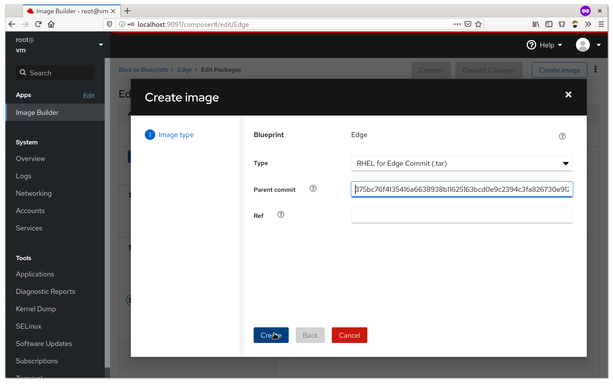

# Building RHEL for Edge with Image Builder

This demonstrates the use of [Image Builder](https://www.osbuild.org/) to
create a (custom) RHEL for Edge [OSTree](https://ostree.readthedocs.io/en/latest/)
commit and how to install those to a disk or an image.

## Requirements

Image Builder is available via [RHEL 8.3 Beta](https://access.redhat.com/products/red-hat-enterprise-linux/beta).
The *KVM Guest Image* is used to install Image Builder and build a
RHEL for Edge commit.
The *Boot ISO* is then used to install that commit.

Name            | Filename
----------------|---------------------------------
Boot ISO        | rhel-8.3-beta-1-x86_64-boot.iso
KVM Guest Image | rhel-8.3-beta-1-x86_64-kvm.qcow2


## Install Image Builder

### Run RHEL beta via VM script

A small helper script is used to start the RHEL 8.3 Guest Image. It uses
cloud init to provision a root user (password `r`). The script also enables
port forwarding for the ssh and web console ports (`22` → `2222` (host) and
`9090` → `9091`).

```
vm --persist rhel-8.3-beta-1-x86_64-kvm.qcow2
```

### Register the system

To be able to install packages the VM must be registered via:

```
subscription-manager register --username <redhat_login_username> --password <redhat_login_password>
subscription-manager role --set="Red Hat Enterprise Linux Server"
subscription-manager service-level --set="Self-Support"
subscription-manager usage --set="Development/Test"
subscription-manager attach
```

### Install Image Builder

```
yum install osbuild-composer cockpit-composer
```

### Enable web console
The Image Builder front end is a plugin to the web console (*cockpit*),
which needs to be enabled.
```
systemctl enable --now cockpit.socket
```

## Build a RHEL for Edge commit

Navigate to the web console via a browser on the host. URL: http://localhost:9091
There, *Image Builder* is found under *Apps* in the right menu.
Images, or in our case,commits, are generated from so called *Blueprints*,
which are customizations that are applied to existing *Image Types*,
e.g. "RHEL for Edge commit". Internally there is a queue that will
distribute compose requests to workers, which in turn are building the
commits / images. The UI flow is as follows:

 1. Activate the Image Builder service.
 2. Create a Blueprint 
 3. Add packages (optionally) 
 4. Create the commit 
 5. **Wait**
 6. Tarball with the commit is ready to download 

### Build via the command line

Commits can also build from the command line, via the help of
the `composer-cli` tool (`yum install composer-cli`).

A new blueprint is created from a TOML file, e.g. [`blueprint.toml`](blueprint.toml):

```
$> composer-cli blueprints push blueprint.toml
```

From this a compose is created for the previously created blueprint
(`Edge`). The type of the compose here is `rhel-edge-commit`. The
UUID if the compose can later be used to obtain the artifact.

```
$> composer-cli compose start-ostree Edge rhel-edge-commit "" ""
Compose <uuid> added to the queue
```

The status of a compose can be inspected via:

```
$> composer-cli compose status
<uuid> RUNNING  Thu Jul 30 09:36:14 2020 Edge            0.0.1 rhel-edge-commit
```

Finally the commit can be downloaded via
```
$> composer-cli compose image <uuid>
<uuid>-commit.tar: 633.73 MB
```

## Inspect the commit

Extract the downloaded tarball via `tar xvf <uuid>-commit.tar`. It should
contain a `compose.json` and a `repo` directory. The former contains the
metadata about the commit, like the "Ref" (`ref`) and the commit id
(`ostree-commit`). The `repo` folder is a OSTree repository that contains
the commit.
The `ostree` and `rpm-ostree` commands can be used to inspect the contents:
The list of rpm packages included in the commit can be listed via
```
# print a list of packages in the commit
rpm-ostree db list rhel/8/x86_64/edge --repo=repo
```

## Install the commit

### Setup a webserver

In order to fetch the commit from the (generic) installer, it needs to be
served via HTTP. This can be done either via a small Go binary (`main.go`),
that can be run with:

```
go run main.go
```

Or a container can be prepared to serve the commit.

```
podman build -t edge-server --build-arg commit=<uuid>-commit.tar .
podman run --rm -p 8000:80 edge-server
```

### Install to a disk via Anaconda

The installer, anaconda, on the `boot.iso` installation medium is can
be used to install the commit. To configure the installer to use the
newly build commit, a "kickstart" configuration [`edge.ks`](edge.ks),
is used. It is setup for non-interactive, text-based installation.
The important line within the kickstart is the `ostreesetup` directive
which instructs the installer to fetch and deploy the commit.
Additionally a user `core` (pw: `edge`) is created.

For demonstration purposes we create an empty `qcow2` with a size of
`5G`, to act as the installation target:

```
qemu-img create -f qcow2 disk.qcow2 5G
```

The installer is run with qemu:
```
qemu-system-x86_64 \
  -m 2048 \
  -enable-kvm \
  -device virtio-net-pci,netdev=n0 \
  -netdev user,id=n0,net=10.0.2.0/24 \
  -drive file=disk.qcow2 \
  -cdrom rhel-8.3-beta-1-x86_64-boot.iso
```

To use the prepared kicksstart file, instead of the default one of
the `boot.iso`, an additional kernel parameter is needed (hit `TAB`
on the `Install Red Hat Enterprise Linux 8.3` entry):

```
inst.ks=http://10.0.2.2:8000/edge.ks
```


As an alternative to supplying the kickstart location via the kernel
command line, the `mkksiso` (`lorax` package) can be used to inject
the kickstart file into the boot iso:

```
mkksiso edge.ks rhel-8.3-beta-1-x86_64-boot.iso boot.iso
```

### Updates

Updates are delivered in form of new commits. This provides one
of the most important features of OSTree: atomic and safe updates.
This means that an update of the system to a new commit will be
deployed either fully or not at all, even if the update process
gets interrupted. Additionally, the old state of the system, i.e.
the deployment of the old commit, is kept around. In case the new
update does not work as expected, it is easy to go back to the
old commit.

Creating a new update commit, which can include new versions of
packages or additional packages, is the same as creating a new
"image", in Image Builder terms, but with the commit id of the
current deployment (or commit) as the *parent*. On a booted system
the commit id can be found via `rpm-ostree status`.



After the new commit is built, it needs to be served via http,
very much like the initial commit above. Then the system can
be updated via

```
rpm-ostree update
```

This will create a new deployment of the new commit. A reboot, via
`systemctl reboot`, is all that is necessary to boot into that
new deployment.
If something in the new deployment is not as it should be, the old
deployment can be restored via `rpm-ostree rollback`.
